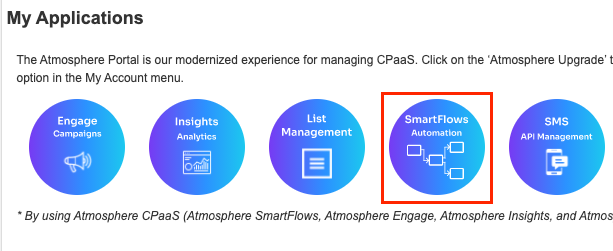

# INTELEPEER CHATBOT INTEGRATION

### TABLE OF CONTENTS

- [Introduction](#introduction)
  - [Features](#features)
- [Prepare your Inbenta instances](#prepare-your-inbenta-instances)
  - [Text Content](#text-content)
  - [Building the Intelepeer Connector](#building-the-intelepeer-connector)
    - [Required Configuration](#required-configuration)
    - [Optional Configuration](#optional-configuration)
  - [CONVERSATION (conversation.php)](#conversation-conversationphp)
  - [ENVIRONMENTS (environments.php)](#environments-environmentsphp)
  - [ESCALATION (chat.php)](#escalation-chatphp)
  - [Deployment](#deployment)
- [Intelepeer Configuration](#intelepeer-configuration)
  - [Account](#account)
  - [Template](#template)
  - [Flows](#flows)
  - [Initial Vars](#initial-vars)
  - [Debug (optional)](#debug-optional)
  - [Token](#token)

## Introduction

If you want your users to use voice / SMS to chat with Inbenta’s chatbot, you could use this connector to integrate with [Intelepeer](https://www.intelepeer.com/). This connects to Intelepeer’s SmartFlows.

### Features

The following features of Inbenta’s chatbot are supported in the Intelepeer integration for voice and SMS.

- Answer Text.
- Sidebubble.
- Multiple options.
- Polar Questions.
- Dialogs.
- Forms, Actions & Variables (For voice implementation, keep in mind not all variable types work best with voice. Example: Email, Date).

## Prepare your Inbenta instances

### Text Content

The content from your instance should be simple: **_avoid the use of HTML tags, multimedia and URLs_**. This is especially important if you are using Voice template, most of the HTML tags are not recognized by the TTS (Text-To-Speech) services and may cause malfunction.

“**Natural Language Search**” is the best **Transition type** for dialogs.

### Building the Intelepeer Connector

#### Required Configuration

In your UI directory, go to **conf**. Here, you have a README.md file with some structure and usage explanations.

Fill the **key** and **secret** values inside the **conf/custom/api.php** file with your Inbenta Chatbot API credentials (Here is the documentation on how to find the key and secret from Inbenta’s backstage. Use the same credentials as backstage to access the article).

Additional, in this file you can define the name of a variable (**init_variable**), this applies in case you have an initial variable to be set when the conversation starts.

```php
'key' => '',
'secret' => '',
'init_variable' => '' //Set the initial variable name, if needed (empty string if there is no initial variable)
```

#### Optional Configuration

There are some optional features that can be enabled from the configuration files. Every optional configuration file should be copied from **/conf/default** and store the custom version in **/conf/custom**. The bot will detect the customization and it will load the customized version. These are the optional configuration files and the configuration fields description.

### CONVERSATION (conversation.php)

- **default:** Contains the API conversation configuration. The values are described below:
  - **answers:**
    - **sideBubbleAttributes:** Dynamic settings to show side-bubble content. This value will append to the main response.
    - **answerAttributes:** Dynamic settings to show as the bot answer. The default is [ "ANSWER_TEXT" ]. Setting multiple dynamic settings generates a bot answer with concatenated values with a newline character (\n).
    - **maxOptions:** Maximum number of options returned in a multiple-choice answer.
  - **forms**
    - **allowUserToAbandonForm:** Whether or not a user is allowed to abandon the form after a number of consecutive failed answers. The default value is **true**.
    - **errorRetries:** The number of times a user can fail a form field before being asked if he wants to leave the form. The default value is 3.
  - **lang:** Language of the bot, represented by its ISO 639-1 code. Accepted values: ca, de, en, es, fr, it, ja, ko, nl, pt, zh, ru, ar, hu, eu, ro, gl, da, sv, no, tr, cs, fi, pl, el, th, id, uk
- **user_type:** Profile identifier from the Backstage knowledge base. Minimum:0. Default:0. You can find your profile list in your Chatbot Instance → Settings → User Types.
- **source:** Source identifier (Default value **intelepeer**) used to filter the logs in the dashboards.

### ENVIRONMENTS (environments.php)

This file allows configuring a rule to detect the current environment for the connector, this process is made through the URL where the application is running. It can check the current **http_host** or the **script_name** in order to detect the environment.

- **development:**
  - **type:** Detection type: check the **http_host** (e.g. www.example.com) or the **script_name** (e.g. /path/to/the/connector/server.php).
  - **regex:** Regex to match with the detection type (e.g. “/^dev.mydomain.com$/m“ will set the “development” environment when the detection type is dev.example.com).

### ESCALATION (chat.php)

This file has the option for make an escalation to a live agent:

- **chat:**
  * **enabled:** Enable or disable HyperChat (“**true**” or “**false**”). This configuration applies only for **SMS implementation**.
  * **version:** HyperChat version. The default and latest one is 1.
  * **appId:** The ID of the HyperChat app. This defines the instance in which the chat opens. You can find it in your instance → Messenger → Settings → Chat.
  * **secret:** Your HyperChat instance application secret. You can find it in your instance → Messenger → Settings → Chat.
  * **roomId:** The room where the chat opens. This is mapped directly to a Backstage queue ID. Numeric value, not a string. You can find your rooms list it in your instance → Messenger → Settings → Queues.
  * **lang:** Language code (in ISO 639-1 format) for the current chat. This is used when the engine checks if there are agents available for this language to assign the chat to one of them.
  * **source:** Source id from the sources in your instance. Numeric value, not a string. The default value is **3**. You can find your sources list it in your instance → Messenger → Settings → Sources.
  * **regionServer:** The geographical region where the HyperChat app lives.
  * **server:** The Hyperchat server URL assigned to your instance. Ask your Inbenta contact for this configuration parameter.
  * **server_port:** The port where to communicate with the Hyperchat server. It’s defined in your instance → Messenger → Settings → Chat -->Port
- **triesBeforeEscalation:** Number of no-result answers in a row after the bot should escalate to an agent (if available). Numeric value, not a string. Zero means it’s disabled.
- **negativeRatingsBeforeEscalation:** Number of negative content ratings in a row after the bot should escalate to an agent (if available). Numeric value, not a string. Zero means it’s disabled.
- **transfer_options:** Here is the number or numbers to transfer. This configuration is only for Voice implementation.
  - **validate_on_transfer:** Possible values: **variable** or ““ (empty string for no validation). If “variable” is set, it’ll check the list of variables_to_check before make the escalation.
  - **variables_to_check:** Array value with the list of the names of variables to check. This applies when 'validate_on_transfer' is 'variable', otherwise empty array is correct.
  - **transfer_numbers:** Array value with the list of numbers for the escalation. Example:

```php
'transfer_numbers' => [
    'default' => '1234561', //Default transfer number ("-" (hyphen) if no number to transfer)
    //'var1_var2' => '1234562', //If validation is made with 'variable'
    //'' => '' //You could have multiple transfer numbers or just the 'default'
]
```

> Since **variables_to_check** is a list, you can have 1 or more variables to check before the escalation. In the **transfer_numbers** array, you must divide every value with an underscore (`var1_var2`). If you have only one variable, you don’t need any additional character (`var1`).

### Deployment

The Intelepeer template must be served by a public web server in order to allow Intelepeer to send the events to it. The environment where the template has been developed and tested has the following specifications

- Apache 2.4
- PHP 7.3
- PHP Curl extension
- Non-CPU-bound
- The latest version of [Composer](https://getcomposer.org/) (Dependency Manager for PHP) to install all dependencies that Inbenta requires for the integration.
- If the client has a **distributed infrastructure**, this means that multiple servers can manage the user session, they must adapt their SessionHandler so that the entire session is shared among all its servers.

## Intelepeer Configuration

### Account

[Login](#https://customer.intelepeer.com/home?n=1) into your Intelepeer account:


### Template

Into your Intelepeer dashboard, go to SmartFlows:



### Flows

In the SmartFlows screen, click on the “+” button:


And then select “Template”:


Search the Template of “**Inbenta Voice**” or “**Inbenta SMS**” and click on “Select”:


### Initial Vars

Once the Template is selected  (Voice or SMS), and the SmartFlow editor opened, you will find a different number of nodes, depending on the selected Template. In the **InitVars** node you can find the configurations for the connector.


These are the values that you should change in the **InitVars** node:

- **$ApiUrl:** This is the public URL where the Connector is hosted.
- **$Token:** This is a customer defined value (password like value), see [Token](#token) section for more details.
- **$UrlDebug:** Url where a debugger is installed, see “Debug” section below for more details.
- **$Debug:** Switch to indicate to SmartFlow if the Debug is On (1) or Off (0), see “Debug” section below for more details.
- **$AudioTryAgain:** (Voice implementation) Text for the message to hear when there is no a voice instruction from the caller.
- **$AudioMaxAttempts:** (Voice implementation) Text that users will hear when the maximum attempts of no messages is reached
- **$AudioError:** (Voice implementation) Change this text to hear the message when an error occurs.
- **$MaxAttempts:** (Voice implementation) Number for maximum attempts of no message received.
- **$FlowID** (SMS implementation) Flow ID of the SMS API flow. This is only if Hyperchat is active (see [SMS API](#sms-api-smart-flow) section)

### SMS API Smart Flow

In order to make Hyperchat escalation work, you'll need to set up the **SMS API Smart Flow** (contact to Intelepeer Support to get this flow active).


Copy the **Flow ID** and paste it in the **InitVar** node and in  **$FlowId** variable, of the SMS Flow:


### Debug (optional)

You can use a debugger to validate what is happening on the flow. In this case, the debugger needs to be in a web server and ready to catch REST requests (POST, GET, etc). You can use the **$UrlDebug** variable to set your own debugger URL and **$Debug** to switch off or on.

In the SmartFlow Template, click on DebugCall node, in the SmartFlow editor:


On the lateral column appears the properties of the node. In this case you can fill the values that applies for your debugger:


And also set the text of the body that is going to be sent to the debugger:


> For production environment the recommendation is to set $Debug = 0

### Token

In order to create a valid connection between Intelepeer and the Inbenta Connector, a Token is needed. This is a password like value, is mandatory and should have a length less than 256 characters.

The defined value for the token must be present in the **$Token** variable, inside the **InitVars** node and in the **custom/intelepeer.php** file, on the Connector:

```php
return [
    'token' => ''
];
```

> The value of the Token is not provided by Inbenta nor Intelepeer, this is defined by the customer.
